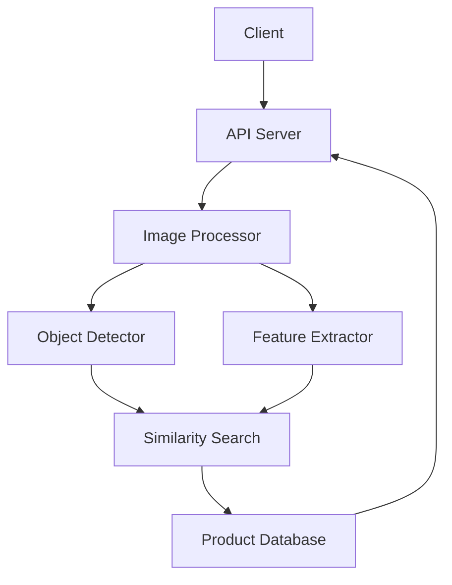

# Gate-Release.io System Patterns

## System Architecture

### High-Level Architecture

### Component Relationships
1. **API Server (FastAPI)**
   - Handles HTTP requests
   - Manages file uploads
   - Coordinates processing pipeline
   - Returns results to client

2. **Image Processor**
   - Preprocesses uploaded images
   - Handles image validation
   - Manages image storage
   - Coordinates detection pipeline

3. **Object Detector (YOLO/Faster R-CNN)**
   - Detects fashion items in images
   - Generates bounding boxes
   - Provides confidence scores
   - Handles multiple items

4. **Feature Extractor (ViT)**
   - Extracts visual features
   - Classifies items
   - Identifies attributes
   - Generates embeddings

5. **Similarity Search**
   - Vector similarity matching
   - Product ranking
   - Database querying
   - Result filtering

6. **Product Database**
   - Stores product information
   - Manages embeddings
   - Handles product metadata
   - Supports efficient querying

## Design Patterns

### 1. Pipeline Pattern
- Sequential processing of images
- Each step handles specific task
- Clear separation of concerns
- Easy to extend and modify

### 2. Repository Pattern
- Abstract database operations
- Centralize data access
- Simplify data management
- Enable easy testing

### 3. Factory Pattern
- Create model instances
- Handle model configuration
- Manage model resources
- Support different backends

### 4. Strategy Pattern
- Interchangeable algorithms
- Flexible processing options
- Easy to add new methods
- Support for different models

## Technical Decisions

### 1. Model Selection
- YOLO for object detection
- Vision Transformer for features
- Cosine similarity for matching
- Pre-trained models initially

### 2. Database Design
- PostgreSQL for product data
- Vector extension for embeddings
- Efficient indexing
- Scalable architecture

### 3. API Design
- RESTful endpoints
- Async processing
- Clear error handling
- Versioned API

### 4. Storage Strategy
- Temporary file storage
- Cloud storage for uploads
- Efficient cleanup
- Secure access

## Component Communication

### 1. Internal Communication
- Direct function calls
- Clear interfaces
- Error propagation
- Logging and monitoring

### 2. External Communication
- HTTP/REST API
- WebSocket for updates
- Secure file transfer
- Rate limiting

## Error Handling

### 1. Error Types
- Input validation errors
- Processing errors
- Database errors
- Network errors

### 2. Error Recovery
- Graceful degradation
- Retry mechanisms
- Fallback options
- Clear error messages 