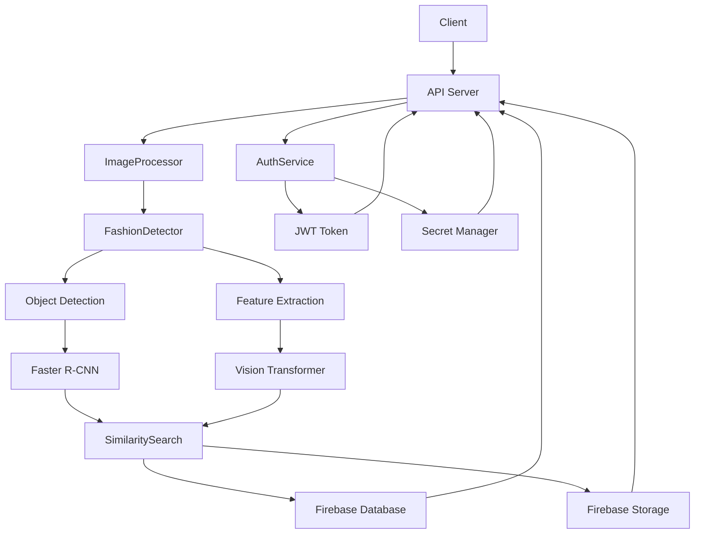

# Gate-Release.io System Patterns

## System Architecture

### High-Level Architecture

### Component Relationships
1. **API Server (FastAPI)**
   - Handles HTTP requests
   - Manages file uploads
   - Coordinates processing pipeline
   - Returns results to client
   - Manages authentication
   - Enforces rate limiting

2. **ImageProcessor**
   - Preprocesses uploaded images
   - Handles image validation
   - Manages image storage in Firebase Storage
   - Coordinates detection pipeline

3. **FashionDetector**
   - Implements Faster R-CNN for detection
   - Uses Vision Transformer for features
   - Provides unified interface
   - Handles model loading

4. **Object Detection (Faster R-CNN)**
   - Detects fashion items in images
   - Generates bounding boxes
   - Provides confidence scores
   - Handles multiple items

5. **Feature Extraction (ViT)**
   - Extracts visual features
   - Generates embeddings
   - Processes detected regions
   - Provides feature vectors

6. **SimilaritySearch**
   - Vector similarity matching
   - Product ranking
   - Firebase queries
   - Result filtering

7. **Firebase Integration**
   - Stores product information
   - Manages embeddings
   - Handles file storage
   - Provides secure access
   - Stores user data

8. **AuthService**
   - Manages user authentication
   - Handles JWT tokens
   - Integrates with Secret Manager
   - Enforces security policies

## Design Patterns

### 1. Service Pattern
- ImageProcessor service
- AuthService
- Clear responsibility separation
- Coordinated processing flow
- Error handling and logging

### 2. Repository Pattern
- Firebase operations abstraction
- Centralized data access
- Simplified data management
- Testing support
- User data management

### 3. Factory Pattern
- Model initialization
- Configuration management
- Resource handling
- Backend flexibility
- Token generation

### 4. Strategy Pattern
- Interchangeable algorithms
- Processing options
- Model selection
- Search strategies
- Authentication methods

### 5. Decorator Pattern
- Rate limiting
- Authentication checks
- Error handling
- Logging
- Monitoring

## Technical Decisions

### 1. Model Selection
- Faster R-CNN for detection
- Vision Transformer for features
- Cosine similarity for matching
- Pre-trained models initially

### 2. Database Design
- Firebase Realtime Database for products
- Firebase Storage for images and embeddings
- Custom indexing for similarity search
- Efficient data structure
- User data storage

### 3. API Design
- RESTful endpoints
- Async processing
- Clear error handling
- Versioned API
- Authentication flow
- Rate limiting

### 4. Storage Strategy
- Firebase Storage for uploads
- Efficient cleanup
- Secure access
- Optimized for retrieval
- User data security

### 5. Security Design
- JWT token authentication
- OAuth2 password flow
- Secret Manager integration
- Rate limiting
- Input validation

## Component Communication

### 1. Internal Communication
- Direct method calls
- Async/await pattern
- Error propagation
- Logging and monitoring
- Token validation

### 2. External Communication
- HTTP/REST API
- Firebase SDK
- Secure file transfer
- Rate limiting
- Token-based auth

## Error Handling

### 1. Error Types
- Input validation errors
- Processing errors
- Firebase errors
- Model errors
- Authentication errors
- Rate limit errors

### 2. Error Recovery
- Graceful degradation
- Retry mechanisms
- Fallback options
- Clear error messages
- Token refresh
- Rate limit handling 