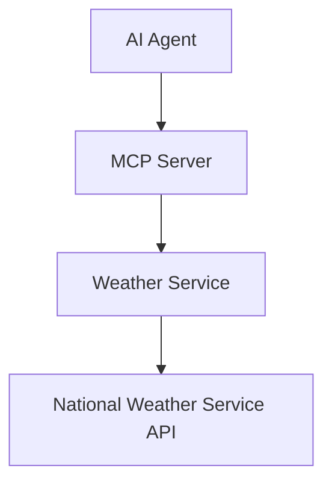

# Weather MCP Server System Patterns

## Architecture Overview

## System Components
1. MCP Server (FastAPI + FastMCP)
   - Handles incoming requests
   - Validates input
   - Formats responses

2. Weather Service Layer
   - Communicates with NWS API
   - Processes weather data
   - Caches responses

3. National Weather Service Integration
   - RESTful API calls
   - JSON response handling
   - Error management

## Design Patterns
1. Adapter Pattern
   - Converting NWS API responses to MCP format
   - Standardizing error responses

2. Factory Pattern
   - Creating weather service instances
   - Managing API clients

3. Strategy Pattern
   - Handling different types of weather queries
   - Managing response formats

## Error Handling
- Standardized error responses
- Graceful degradation
- Retry mechanisms for API calls 